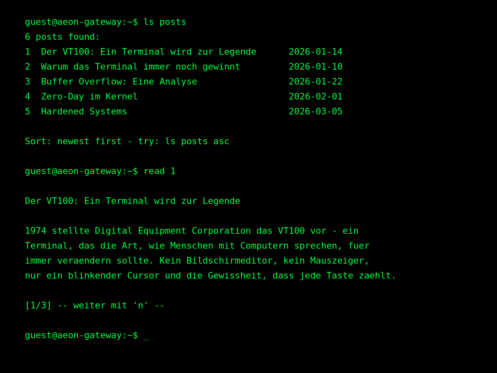

# VT100 Terminal

A classic (non-FSE) WordPress theme that replaces the traditional blog interface with a fully interactive VT100-style terminal emulator. Navigate posts, search content, and read articles — all from a command line.

A classic-theme fork of [HX29 Terminal](https://github.com/Latz/hx29), with no Site Editing / block-template dependency.



---

## Overview

VT100 Terminal renders almost no PHP markup. `header.php`/`footer.php` provide the page shell and mount a `<div id="vt100-root">`; every post, page, and comment is fetched live from the WordPress REST API and displayed as terminal output. The UI is built with React (via `@wordpress/element`) and [react-terminal-ui](https://github.com/jonmbake/react-terminal-ui), styled with the Glass TTY VT220 bitmap font.

Output is printed character-by-character. Links in articles become numbered footnotes. Long content paginates with `[n]ext`.

---

## Requirements

- WordPress 6.0+
- Node.js + npm (only needed to build from source)

---

## Installation

```bash
cd wp-content/themes/
git clone https://github.com/Latz/vt100-terminal
cd vt100-terminal
npm install
npm run build
```

Then activate **VT100 Terminal** in WP Admin → Appearance → Themes.

---

## Commands

### Navigation

| Command | Description |
|---|---|
| `ls posts [asc\|desc]` | List blog posts; shows sort hint with command to flip order |
| `ls pages` | List all static pages |
| `ls categories` / `ls cats` | List all categories |
| `ls tags` | List all tags |
| `ls <sub> --help` | Inline help for any `ls` subcommand |
| `cd <slug or partial name>` | Enter a category or tag filter context; shows a numbered list on multiple matches |
| `cd ..` | Drop one path level (tag first, then category) |
| `cd /` | Return straight to root (remove all filters) |
| `cd -` | Return to the previous context |
| `cd` | Show current filter context |
| `read <n>` / `r <n>` | Open article by number from the last list |
| `n` / `m` | Next page — more list results or next article page |
| `link <n>` / `l <n>` | Open link number n in a new tab |

### Search

| Command | Description |
|---|---|
| `search <term>` | Search post titles via the WP REST API |
| `grep <term>` | Full-text search across all posts with highlighted excerpts |

**Difference:** `search` queries titles server-side (fast, paginated). `grep` fetches all post bodies client-side and shows the matching sentences with the term highlighted in inverse video.

### Comments

| Command | Description |
|---|---|
| `comments <n>` | Show all comments for post n |
| `comment <n> Name: Text` / `c <n> Name: Text` | Post a comment on post n |

Example: `c 1 Ada: Great article!`

### Browsing by Category and Tag

`cd` sets a persistent filter context — all subsequent `ls posts` calls are automatically filtered to that category and/or tag. The shell prompt reflects the active context as a path:

| Active context | Prompt |
|---|---|
| none | `~$` |
| category only | `~/categories/<slug>$` |
| tag only | `~/tags/<slug>$` |
| category + tag | `~/categories/<cat-slug>/tag/<tag-slug>$` |

`cd` accepts a full slug, a full name, or a partial string. A single match enters the context directly. Multiple matches show a numbered list; the prompt changes to `Enter number to select:` so you type the number inline. Any non-number input cancels. Use `man cd` for full details.

### Utilities

| Command | Description |
|---|---|
| `history` | Show recent command history |
| `config [--option value]` | View or change client-side settings |
| `man <command>` | Detailed help page for a command |
| `clear` | Clear the terminal |
| `help` | Brief command overview |
| `<command> --help` | Inline help (supported by `ls` subcommands) |

---

## Language

The UI language is detected automatically from the browser's `navigator.language` setting at page load. No configuration required.

| Browser language | UI language |
|---|---|
| `de`, `de-DE`, `de-AT`, … | German |
| anything else | English |

Locale strings live in `src/i18n/de.js` and `src/i18n/en.js`. To add a new language, copy one of those files, translate the values, and update `src/i18n/index.js` with the new locale code. Intro sequences and idle animations are always in English.

---

## Configuration

### Site-wide defaults (Theme Customizer)

**Appearance → Customize** exposes three sections for the values new visitors (no cookie yet) get on first load, plus feature toggles:

| Section | Settings |
|---|---|
| Terminal | Prompt prefix, typing speed |
| Erstbesucher-Standardwerte | Font size, posts per page, color theme, post order, phosphor glow, scroll behavior |
| Features | Typing glitches on/off, idle screensaver effects on/off |

These are stored as plain `wp_options` rows (`vt100_terminal_*`) and injected into the frontend via `window.vt100` (`inc/enqueue.php`).

### Per-visitor overrides (browser cookie)

Once a visitor changes a setting client-side, it's stored in the `vt100_config` cookie (1-year TTL) and takes precedence over the site defaults above:

```
config --theme a
config --font 18
config --posts 5
config --order asc
```

| Option | Default | Values | Description |
|---|---|---|---|
| `--theme` | `a` | `a` `b` `c` `d` `e` | Color scheme |
| `--font` | `22` | any px value | Font size in pixels |
| `--posts` | `10` | any number | Posts per page in listings |
| `--order` | `desc` | `asc` `desc` | Default sort order for `ls posts` |

---

## Color Themes

| Key | Name | Background | Foreground | Style |
|---|---|---|---|---|
| `a` | VT100 Green | `#000000` | `#00ff00` | Classic phosphor green monochrome |
| `b` | GitHub Dark | `#0d1117` | `#e6edf3` | Modern dark, blue accent |
| `c` | Purple | `#1a0a2e` | `#e0d0ff` | Deep purple with magenta |
| `d` | Solarized Light | `#fdf6e3` | `#657b83` | Light solarized |
| `e` | Amber | `#0a0500` | `#ffb000` | Classic amber phosphor |

Switch with `config --theme b`.

---

## Font

**Glass TTY VT220** — a pixel-perfect digital recreation of the original DEC VT220 character set. Self-hosted as `assets/fonts/glasstty.ttf`. Public Domain.

Fallback: Courier New → Courier → monospace.

---

## Intro Sequences

On first load the terminal plays an animated boot sequence. Three sequences are available, chosen at random:

- **Mainframe** — Hayes modem dial-up, IBM MVS/XA logon
- **DoD Intrusion** — Project Dark Matter hack sequence
- **RobCo Termlink** — Fallout-style terminal login

### Returning visitor intros

Repeat visits are tracked in `localStorage`. The boot sequence escalates across four stages based on how many times the visitor has returned (minimum 1 hour between stage advances):

| Stage | Identity | Prompt |
|---|---|---|
| 1 | Unknown — initial profiling | `guest@aeon-gateway:~$` |
| 2 | Recognized — monitored | `intruder@aeon-gateway:#` |
| 3 | Persistent threat actor | `anon@apex-mainframe:#` |
| 4+ | Trusted operator | `operator@aeon-core:#` |

Each stage shows the visitor's session ID (e.g. `SIG-8942`), last visit timestamp, and visit count.

---

## Idle Sequences

*Toggle: Customizer → Features → Idle screensaver effects.*

After 5 minutes of inactivity the terminal plays a random idle animation. A new sequence is chosen each time (never repeating the same one twice in a row). The idle timer only restarts after the user types a command — not after a keypress alone.

Eight sequences are available, each lazy-loaded as a separate JS chunk:

| Sequence | Description |
|---|---|
| **Neon Flicker** | Sign text flickers between clean and corrupted frames like a failing phosphor display |
| **Network Vortex** | Spinning ASCII vortex sucks in idle network packets; buffer fills until keypress collapses it |
| **Buffer Melt** | A status line erodes character-by-character into block glyphs; keypress restores it |
| **Cyberdeck Heartbeat** | Core temperature pulses 60→84% in a wave; separator line shifts between `---` and `===` |
| **Overheat** | Thermal critical alert with jittering temperature readout and cycling voltage dump bar |
| **Grid Glitch** | Hex values swap, intercepted ticker scrolls, glitch codes morph every 300ms |
| **Synapse Desync** | Sync-rate counts down; chromatic aberration bracket jitters left/right; at 0% screen clears |
| **Memory Leak** | Files shredded right-to-left with `#` characters while a progress bar fills |

Each sequence ends with an `[ OK ]` confirmation after the user presses a key.

---

## Hardware Simulation Effects

VT100 Terminal simulates the physical characteristics of 1980s CRT terminal hardware.

### Baud-Rate Stutter
Output prints at approximately 1200 baud (6–10ms per character). A 2% chance per mid-word character triggers a 100–250ms transmission freeze — the text halts mid-word then resumes, simulating line noise on a slow modem connection.

### Key-Bounce
Vintage mechanical keyboards (e.g. DEC LK201) were prone to switch bounce — registering a keystroke twice. A 0.5% chance per keypress doubles the character, then auto-corrects after 120ms. A `[KEY_BOUNCE RECALIBRATED]` notice appears briefly in the corner.

### Horizontal Sync Tear
A 3% chance per output line briefly applies `skewX` and `clip-path` to the last rendered line for 40–80ms, simulating a horizontal sync slip from a voltage fluctuation in the flyback transformer.

### Scroll Voltage Drop
Every time a new line is added, the terminal briefly dims to 94% opacity then fades back, simulating the current spike from the flyback transformer repositioning the electron beam.

### Mains Hum Bar
Every 1–2 minutes (random), a faint brightness band sweeps slowly down the full screen over 3 seconds — the 50Hz mains interference characteristic of unshielded analog monitor hardware.

### CRT Vignette
A fixed radial gradient overlay darkens the screen edges and corners by up to 30%, replicating the dimming caused by the electron beam traveling further to reach the curved glass periphery.

### Periodic Glitch Messages
*Toggle: Customizer → Features → Typing glitches.*

Every 90–150 seconds the terminal inserts a random system error message (kernel panics, segfaults, security alerts).

### Random Intro Corruption
`__phases` lines in intro sequences generate a randomly corrupted middle frame at runtime — different corruption pattern each page load.

---

## Technical Architecture

| Layer | Technology |
|---|---|
| UI framework | React via `@wordpress/element` |
| Terminal component | `react-terminal-ui` |
| Data source | WP REST API `/wp-json/wp/v2` |
| Build tool | `wp-scripts` (webpack) |
| Runtime config | `window.vt100` injected by `wp_localize_script` |

**No block templates, no `theme.json`.** `header.php` opens `<div id="vt100-root">`, `footer.php` closes it; the compiled JS bundle mounts React into that node. All content rendering happens client-side.

**`window.vt100`** provides runtime values without an extra API call:
- `rest_root` / `nonce` — REST API base URL and WP nonce for authenticated requests
- `site_name` / `author`, `uid` / `uid_new` — shell prompt and comment-attribution data
- `prompt_prefix`, `typing_speed`, `font`, `posts`, `theme`, `order`, `glow`, `scroll` — Customizer-configured first-visit defaults
- `glitches_enabled`, `idle_effects_enabled` — Customizer feature toggles

**Session tracking** — `localStorage` stores three values per visitor:
- `vt100_sig` — permanent random ID (e.g. `SIG-8942`)
- `vt100_visits` — visit counter (increments only after 1h gap)
- `vt100_last_visit` — ISO timestamp of last visit

**Pager system** — six types:
- `article` — paginated by terminal height (character-count based)
- `posts` / `pages` — paginated by configured posts-per-page
- `categories` / `tags` — paginated taxonomy term listings
- `search` — like posts, but filtered by search term across pages
- `grep` — paginated by whole match-blocks

**Idle sequences** are lazy-loaded webpack chunks (`src/idle/*.js`). Each exports a single default `async function(ctx)` receiving `{ key, wait, append, update, scrollTerminal, idleActiveRef }`. Adding a new sequence requires only creating a new file and adding its loader to the `SEQUENCE_LOADERS` array in `src/hooks/useIdleSequence.js`.

**Link handling** — `<a>` tags in post HTML are extracted during parsing and appended as numbered footnotes below the article. `l <n>` opens footnote n; outside an article it opens the nth post URL from the last listing.

**Arrow key history** — captured in the `capture` phase on the hidden input to intercept before `react-terminal-ui`, with native setter dispatch to keep React state in sync.

---

## Testing

```bash
# JS unit tests (Vitest + Testing Library)
npm test

# PHP unit tests (PHPUnit, requires a WordPress test environment)
bin/install-wp-tests.sh <db-name> <db-user> <db-pass> [db-host]
composer install
vendor/bin/phpunit
```

A SonarCloud config is included under `bin/` (`sonar-project.properties`, `sonar-scanner.sh`) — set `SONAR_TOKEN` and run `bin/sonar-scanner.sh`.

---

## License

GNU General Public License v2 or later — see [https://www.gnu.org/licenses/gpl-2.0.html](https://www.gnu.org/licenses/gpl-2.0.html)
